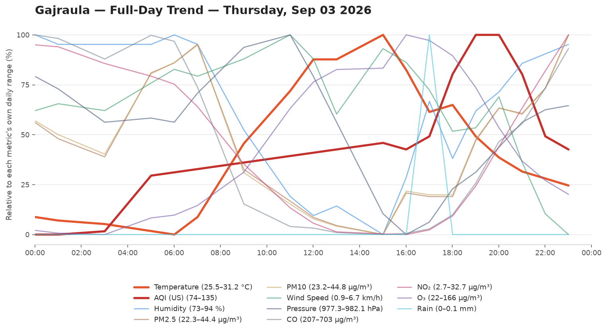
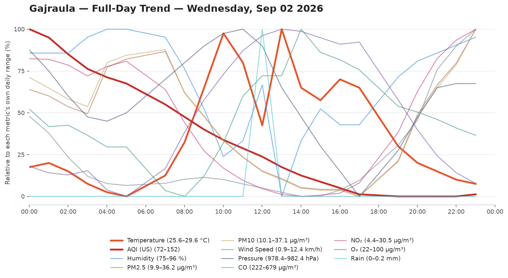
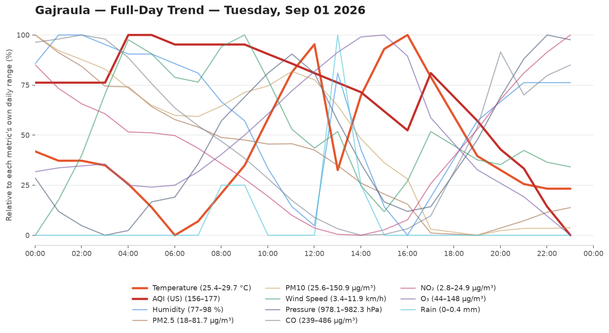
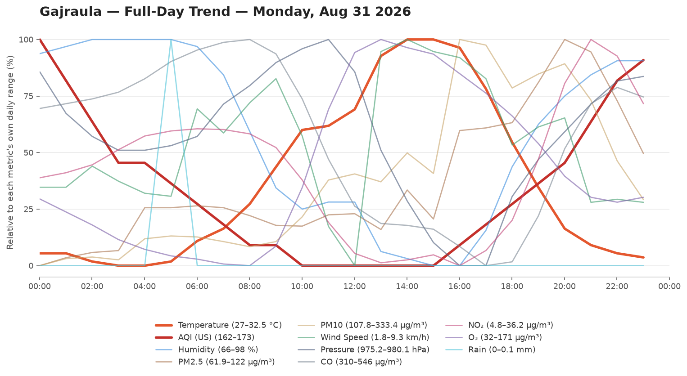
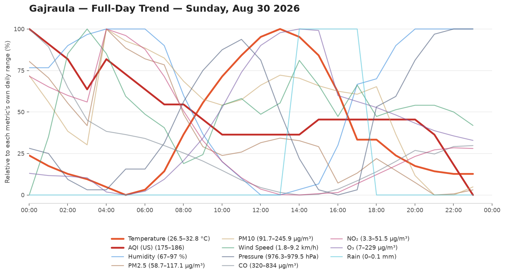

# 🌦️ Weather & AQI Logger

Automated Weather Logger. Logs Temperature,Humidity,Wind speed, Pressure and Air Quality Every Hour.

- **Data source:** [Open-Meteo](https://open-meteo.com/)
- **Update frequency:** every hour, via .[cron-job](https://cron-job.org/)
- **Raw data:** [`data/weather_log.csv`](data/weather_log.csv)

## 📊 Current Conditions

<!-- DATA-START -->
**Last updated:** `2026-09-04 16:30:32 UTC`

| Metric | Value |
|---|---|
| 🌡️ Temperature | 26.6 °C |
| 💧 Humidity | 96 % |
| 🌧️ Rain (last hr) | 0.0 mm |
| 💨 Wind Speed | 5.8 km/h |
| 🧭 Wind Direction | 74° |
| 🔵 Pressure | 982.8 hPa |
| 🌫️ AQI (US) | 101 — Unhealthy for Sensitive Groups 🟠 |
| PM2.5 | 40.6 µg/m³ |
| PM10 | 40.9 µg/m³ |

<details><summary>Last 24 readings</summary>

| Time (UTC) | Temp °C | Rain mm | AQI | Wind km/h | Humidity % |
|---|---|---|---|---|---|
| 2026-09-04 16:30:32 | 26.6 | 0.0 | 101 | 5.8 | 96 |
| 2026-09-04 15:30:33 | 26.7 | 0.0 | 101 | 5.4 | 96 |
| 2026-09-04 14:30:38 | 26.9 | 0.0 | 101 | 6.2 | 95 |
| 2026-09-04 13:30:34 | 27.2 | 0.0 | 101 | 6.3 | 94 |
| 2026-09-04 12:30:33 | 28.5 | 0.0 | 100 | 6.8 | 85 |
| 2026-09-04 11:30:34 | 29.1 | 0.0 | 100 | 7.8 | 81 |
| 2026-09-04 10:30:29 | 29.7 | 0.0 | 101 | 7.1 | 78 |
| 2026-09-04 09:30:36 | 29.9 | 0.0 | 99 | 7.1 | 77 |
| 2026-09-04 08:30:32 | 29.8 | 0.0 | 99 | 7.4 | 78 |
| 2026-09-04 07:30:31 | 28.2 | 0.0 | 99 | 8.2 | 86 |
| 2026-09-04 06:30:33 | 29.1 | 0.2 | 99 | 9.5 | 77 |
| 2026-09-04 05:31:04 | 29.5 | 0.1 | 99 | 9.7 | 78 |
| 2026-09-04 04:30:28 | 29.2 | 0.0 | 99 | 7.8 | 82 |
| 2026-09-04 03:30:31 | 28.3 | 0.0 | 99 | 5.9 | 88 |
| 2026-09-04 02:30:30 | 27.2 | 0.0 | 98 | 5.4 | 93 |
| 2026-09-04 01:30:32 | 26.2 | 0.0 | 97 | 3.8 | 96 |
| 2026-09-04 00:30:35 | 25.8 | 0.0 | 95 | 1.5 | 97 |
| 2026-09-03 22:30:35 | 26.3 | 0.0 | 94 | 3.2 | 96 |
| 2026-09-03 21:30:30 | 26.5 | 0.0 | 98 | 2.4 | 95 |
| 2026-09-03 20:30:33 | 26.6 | 0.1 | 97 | 1.7 | 93 |
| 2026-09-03 19:30:31 | 26.6 | 0.1 | 97 | 1.5 | 95 |
| 2026-09-03 18:30:41 | 26.5 | 0.0 | 98 | 1.8 | 95 |
| 2026-09-03 17:30:32 | 26.9 | 0.0 | 100 | 0.9 | 93 |
| 2026-09-03 16:30:35 | 27.1 | 0.0 | 104 | 1.5 | 92 |

</details>
<!-- DATA-END -->

## 📈 Full-Day Trend

Every logged metric for yesterday (the last fully completed day, midnight-to-midnight IST), normalized to its own range so temperature, AQI, humidity, and the rest can be compared by shape on one chart. Only changes once a day, when a new day rolls over.


## 🗂️ Chart History

Every day's full-day trend chart, newest first. No retention limit — this grows forever.

<!-- HISTORY-START -->
<details><summary>Last 28 day(s)</summary>

**2026-09-03**


**2026-09-02**


**2026-09-01**


**2026-08-31**


**2026-08-30**


**2026-08-29**


**2026-08-28**


**2026-08-27**


**2026-08-26**


**2026-08-25**


**2026-08-24**


**2026-08-23**


**2026-08-22**


**2026-08-21**


**2026-08-20**


**2026-08-19**


**2026-08-18**


**2026-08-17**


**2026-08-16**


**2026-08-15**


**2026-08-14**


**2026-08-13**


**2026-08-12**


**2026-08-11**


**2026-08-10**


**2026-08-09**


**2026-08-08**


**2026-08-07**


</details>
<!-- HISTORY-END -->

## 📁 Repo structure

```
weather-logger/
├── .github/workflows/update-weather.yml
├── data/weather_log.csv
├── data/day_chart.png
├── data/chart-history/        # every day, unlimited, e.g. 2026-08-08.png
├── scripts/fetch_weather.py
├── scripts/update_readme.py
├── scripts/generate_chart.py
├── scripts/backfill_chart_history.py
├── README.md
└── requirements.txt
```
