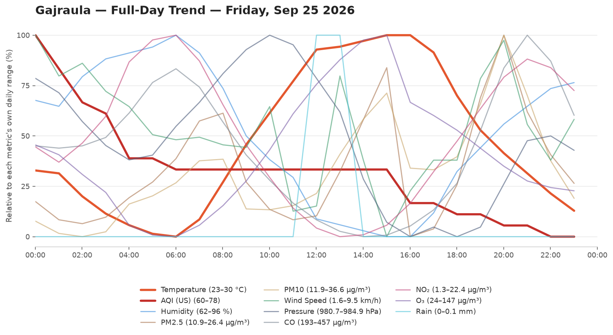
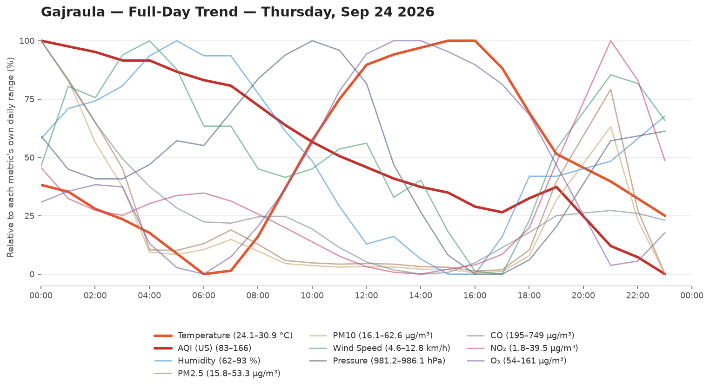
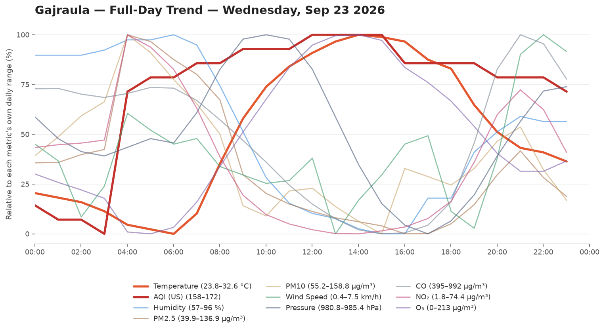
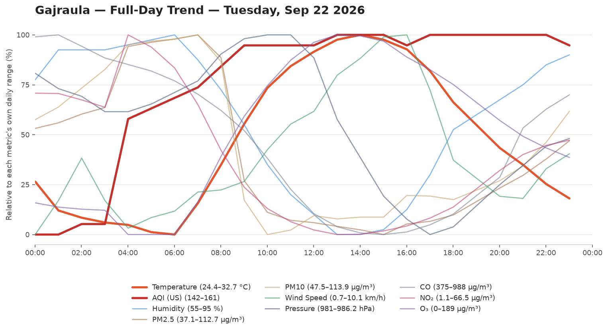
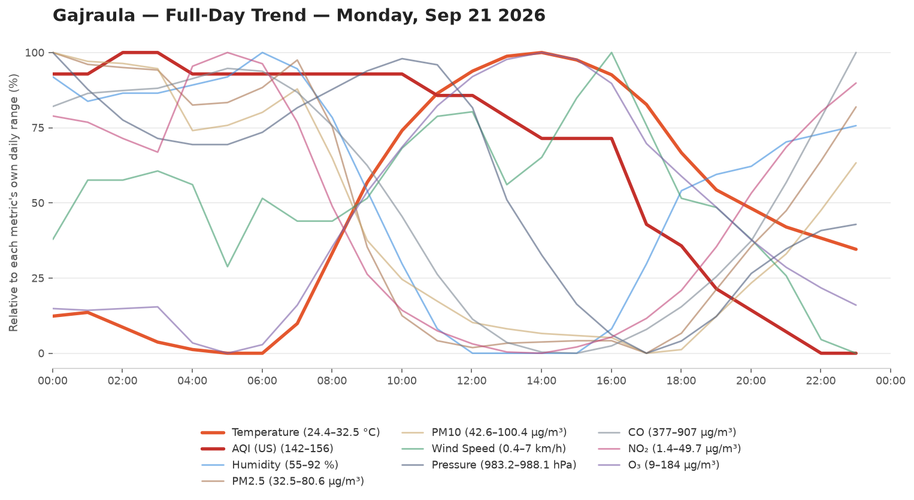
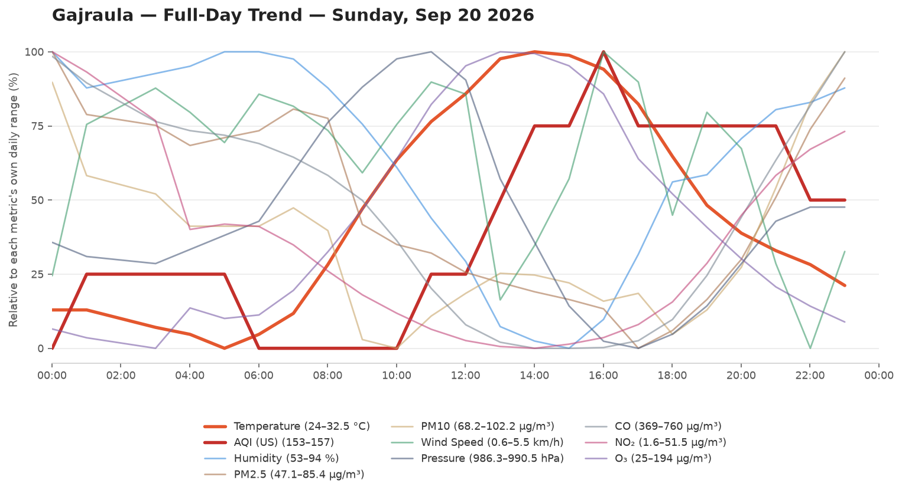
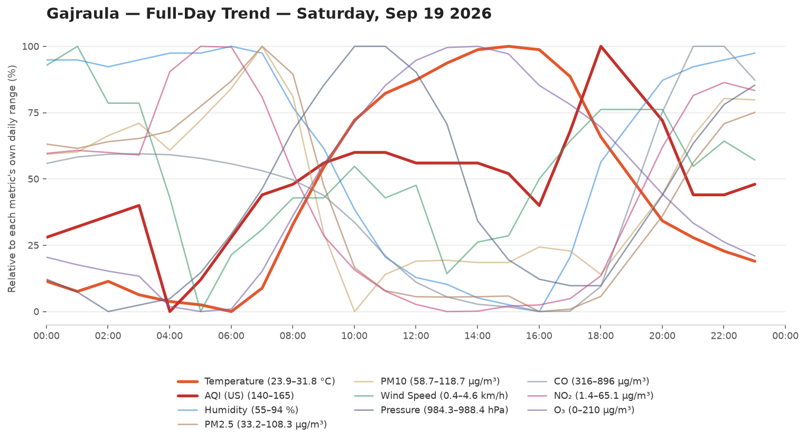
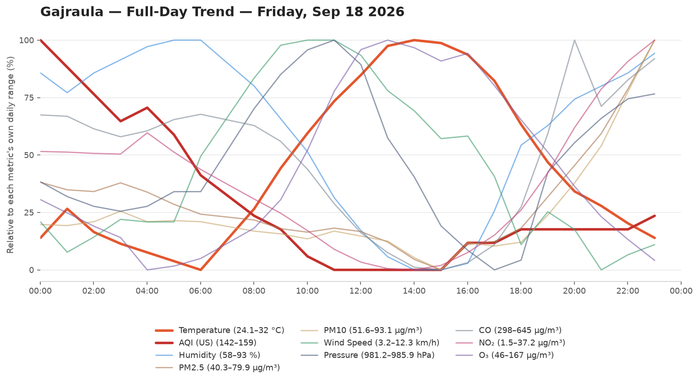

# 🌦️ Weather & AQI Logger

Automated Weather Logger. Logs Temperature,Humidity,Wind speed, Pressure and Air Quality Every Hour.

- **Data source:** [Open-Meteo](https://open-meteo.com/)
- **Update frequency:** every hour, via .[cron-job](https://cron-job.org/)
- **Raw data:** [`data/weather_log.csv`](data/weather_log.csv)

## 📊 Current Conditions

<!-- DATA-START -->
**Last updated:** `2026-09-26 04:30:28 UTC`

| Metric | Value |
|---|---|
| 🌡️ Temperature | 23.5 °C |
| 💧 Humidity | 92 % |
| 🌧️ Rain (last hr) | 0.3 mm |
| 💨 Wind Speed | 6.4 km/h |
| 🧭 Wind Direction | 335° |
| 🔵 Pressure | 981.2 hPa |
| 🌫️ AQI (US) | 84 — Moderate 🟡 |
| PM2.5 | 46.8 µg/m³ |
| PM10 | 57.6 µg/m³ |

<details><summary>Last 24 readings</summary>

| Time (UTC) | Temp °C | Rain mm | AQI | Wind km/h | Humidity % |
|---|---|---|---|---|---|
| 2026-09-26 04:30:28 | 23.5 | 0.3 | 84 | 6.4 | 92 |
| 2026-09-26 03:30:29 | 22.6 | 0.6 | 82 | 4.9 | 93 |
| 2026-09-26 02:30:35 | 22.3 | 0.1 | 80 | 7.4 | 92 |
| 2026-09-26 01:30:30 | 22.0 | 0.2 | 78 | 6.9 | 92 |
| 2026-09-26 00:30:29 | 22.1 | 0.9 | 76 | 0.5 | 89 |
| 2026-09-25 23:30:32 | 22.1 | 1.1 | 75 | 7.2 | 89 |
| 2026-09-25 22:30:32 | 22.3 | 0.1 | 73 | 10.0 | 87 |
| 2026-09-25 21:30:29 | 22.7 | 0.1 | 61 | 4.4 | 80 |
| 2026-09-25 20:30:35 | 22.8 | 0.0 | 60 | 5.9 | 77 |
| 2026-09-25 19:30:31 | 22.9 | 0.0 | 60 | 8.4 | 78 |
| 2026-09-25 18:30:31 | 23.6 | 0.0 | 60 | 2.7 | 90 |
| 2026-09-25 17:30:34 | 23.9 | 0.0 | 60 | 6.2 | 88 |
| 2026-09-25 16:30:35 | 24.5 | 0.0 | 60 | 4.6 | 87 |
| 2026-09-25 15:30:33 | 25.2 | 0.0 | 61 | 6.0 | 84 |
| 2026-09-25 14:30:34 | 25.9 | 0.0 | 61 | 9.3 | 81 |
| 2026-09-25 13:30:31 | 26.7 | 0.0 | 62 | 7.8 | 77 |
| 2026-09-25 12:30:33 | 27.9 | 0.0 | 62 | 4.6 | 73 |
| 2026-09-25 11:30:28 | 29.4 | 0.0 | 63 | 4.6 | 66 |
| 2026-09-25 10:30:44 | 30.0 | 0.0 | 63 | 3.4 | 62 |
| 2026-09-25 09:30:30 | 30.0 | 0.0 | 66 | 1.6 | 62 |
| 2026-09-25 08:30:33 | 29.8 | 0.0 | 66 | 4.6 | 63 |
| 2026-09-25 07:30:31 | 29.6 | 0.1 | 66 | 7.9 | 64 |
| 2026-09-25 06:30:30 | 29.5 | 0.1 | 66 | 2.8 | 65 |
| 2026-09-25 05:30:33 | 28.4 | 0.0 | 66 | 2.6 | 72 |

</details>
<!-- DATA-END -->

## 📈 Full-Day Trend

Every logged metric for yesterday (the last fully completed day, midnight-to-midnight IST), normalized to its own range so temperature, AQI, humidity, and the rest can be compared by shape on one chart. Only changes once a day, when a new day rolls over.


## 🗂️ Chart History

Every day's full-day trend chart, newest first. No retention limit — this grows forever.

<!-- HISTORY-START -->
<details><summary>Last 50 day(s)</summary>

**2026-09-25**


**2026-09-24**


**2026-09-23**


**2026-09-22**


**2026-09-21**


**2026-09-20**


**2026-09-19**


**2026-09-18**


**2026-09-17**


**2026-09-16**


**2026-09-15**


**2026-09-14**


**2026-09-13**


**2026-09-12**


**2026-09-11**


**2026-09-10**


**2026-09-09**


**2026-09-08**


**2026-09-07**


**2026-09-06**


**2026-09-05**


**2026-09-04**


**2026-09-03**


**2026-09-02**


**2026-09-01**


**2026-08-31**


**2026-08-30**


**2026-08-29**


**2026-08-28**


**2026-08-27**


**2026-08-26**


**2026-08-25**


**2026-08-24**


**2026-08-23**


**2026-08-22**


**2026-08-21**


**2026-08-20**


**2026-08-19**


**2026-08-18**


**2026-08-17**


**2026-08-16**


**2026-08-15**


**2026-08-14**


**2026-08-13**


**2026-08-12**


**2026-08-11**


**2026-08-10**


**2026-08-09**


**2026-08-08**


**2026-08-07**


</details>
<!-- HISTORY-END -->

## 📁 Repo structure

```
weather-logger/
├── .github/workflows/update-weather.yml
├── data/weather_log.csv
├── data/day_chart.png
├── data/chart-history/        # every day, unlimited, e.g. 2026-08-08.png
├── scripts/fetch_weather.py
├── scripts/update_readme.py
├── scripts/generate_chart.py
├── scripts/backfill_chart_history.py
├── README.md
└── requirements.txt
```
