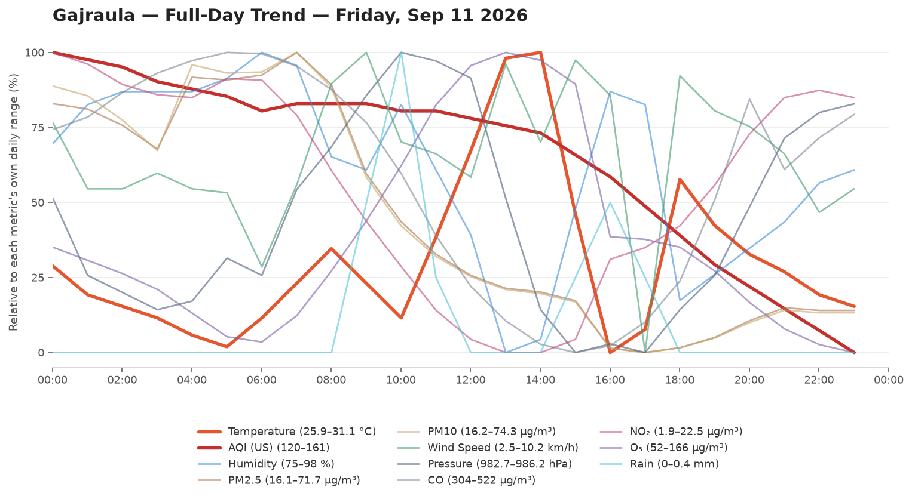
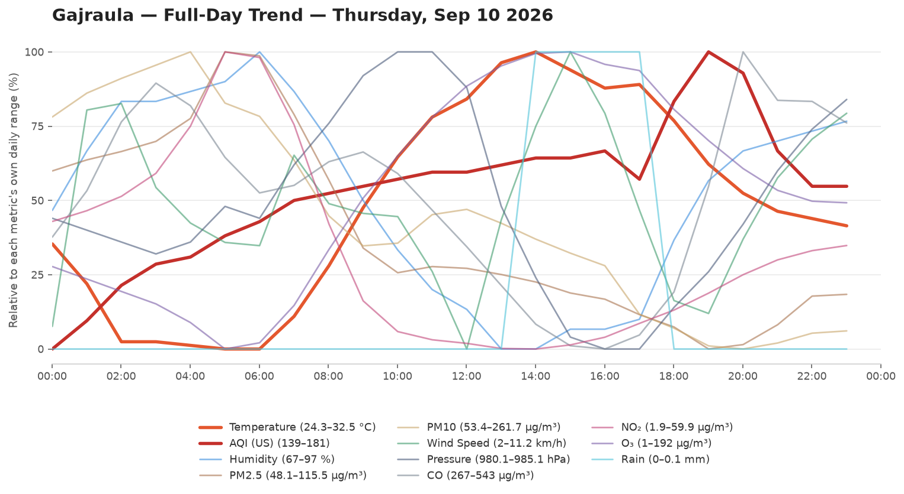
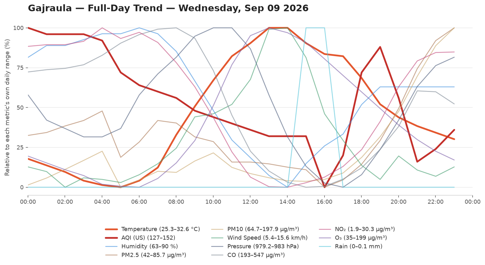
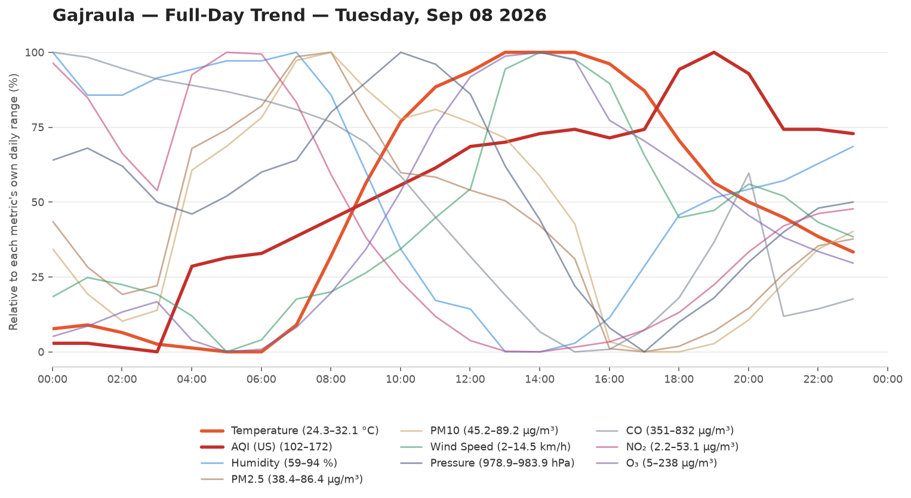
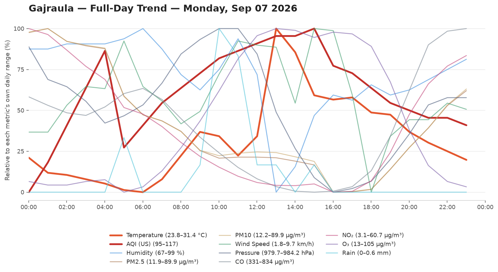
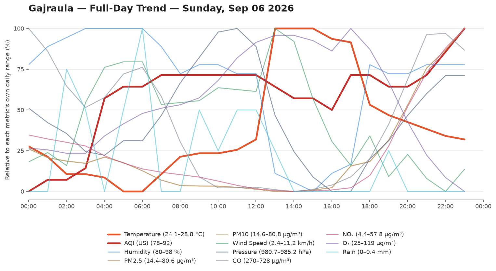
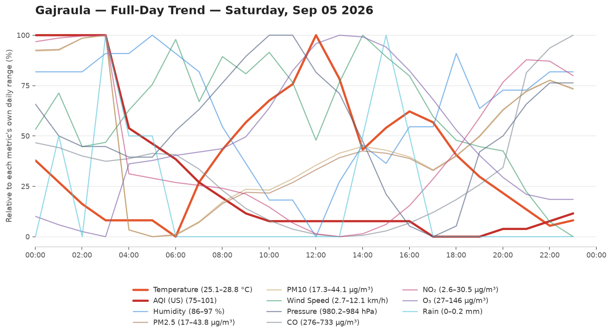

# 🌦️ Weather & AQI Logger

Automated Weather Logger. Logs Temperature,Humidity,Wind speed, Pressure and Air Quality Every Hour.

- **Data source:** [Open-Meteo](https://open-meteo.com/)
- **Update frequency:** every hour, via .[cron-job](https://cron-job.org/)
- **Raw data:** [`data/weather_log.csv`](data/weather_log.csv)

## 📊 Current Conditions

<!-- DATA-START -->
**Last updated:** `2026-09-12 00:30:37 UTC`

| Metric | Value |
|---|---|
| 🌡️ Temperature | 26.0 °C |
| 💧 Humidity | 97 % |
| 🌧️ Rain (last hr) | 0.1 mm |
| 💨 Wind Speed | 7.6 km/h |
| 🧭 Wind Direction | 22° |
| 🔵 Pressure | 985.4 hPa |
| 🌫️ AQI (US) | 90 — Moderate 🟡 |
| PM2.5 | 28.9 µg/m³ |
| PM10 | 29.5 µg/m³ |

<details><summary>Last 24 readings</summary>

| Time (UTC) | Temp °C | Rain mm | AQI | Wind km/h | Humidity % |
|---|---|---|---|---|---|
| 2026-09-12 00:30:37 | 26.0 | 0.1 | 90 | 7.6 | 97 |
| 2026-09-11 23:30:30 | 26.1 | 0.0 | 93 | 5.1 | 93 |
| 2026-09-11 22:30:38 | 26.3 | 0.0 | 97 | 6.3 | 91 |
| 2026-09-11 21:30:31 | 26.5 | 0.1 | 104 | 8.8 | 89 |
| 2026-09-11 20:30:44 | 26.7 | 0.0 | 108 | 9.1 | 90 |
| 2026-09-11 19:30:33 | 26.5 | 0.0 | 113 | 8.0 | 93 |
| 2026-09-11 18:30:36 | 26.7 | 0.0 | 117 | 9.0 | 89 |
| 2026-09-11 17:30:38 | 26.7 | 0.0 | 120 | 6.7 | 89 |
| 2026-09-11 16:30:34 | 26.9 | 0.0 | 123 | 6.1 | 88 |
| 2026-09-11 15:30:29 | 27.3 | 0.0 | 126 | 7.6 | 85 |
| 2026-09-11 14:30:31 | 27.6 | 0.0 | 129 | 8.3 | 83 |
| 2026-09-11 13:30:30 | 28.1 | 0.0 | 132 | 8.7 | 81 |
| 2026-09-11 12:30:31 | 28.9 | 0.0 | 136 | 9.6 | 79 |
| 2026-09-11 11:30:32 | 26.3 | 0.1 | 140 | 2.5 | 94 |
| 2026-09-11 10:30:30 | 25.9 | 0.2 | 144 | 9.1 | 95 |
| 2026-09-11 09:30:30 | 28.3 | 0.1 | 147 | 10.0 | 86 |
| 2026-09-11 08:30:32 | 31.1 | 0.0 | 150 | 7.9 | 76 |
| 2026-09-11 07:30:32 | 31.0 | 0.0 | 151 | 9.9 | 75 |
| 2026-09-11 06:30:29 | 29.4 | 0.0 | 152 | 7.0 | 84 |
| 2026-09-11 05:30:30 | 27.9 | 0.1 | 153 | 7.6 | 89 |
| 2026-09-11 04:30:35 | 26.5 | 0.4 | 153 | 7.9 | 94 |
| 2026-09-11 03:30:30 | 27.1 | 0.2 | 154 | 10.2 | 89 |
| 2026-09-11 02:30:28 | 27.7 | 0.0 | 154 | 9.4 | 90 |
| 2026-09-11 01:30:31 | 27.1 | 0.0 | 154 | 6.8 | 97 |

</details>
<!-- DATA-END -->

## 📈 Full-Day Trend

Every logged metric for yesterday (the last fully completed day, midnight-to-midnight IST), normalized to its own range so temperature, AQI, humidity, and the rest can be compared by shape on one chart. Only changes once a day, when a new day rolls over.


## 🗂️ Chart History

Every day's full-day trend chart, newest first. No retention limit — this grows forever.

<!-- HISTORY-START -->
<details><summary>Last 36 day(s)</summary>

**2026-09-11**


**2026-09-10**


**2026-09-09**


**2026-09-08**


**2026-09-07**


**2026-09-06**


**2026-09-05**


**2026-09-04**


**2026-09-03**


**2026-09-02**


**2026-09-01**


**2026-08-31**


**2026-08-30**


**2026-08-29**


**2026-08-28**


**2026-08-27**


**2026-08-26**


**2026-08-25**


**2026-08-24**


**2026-08-23**


**2026-08-22**


**2026-08-21**


**2026-08-20**


**2026-08-19**


**2026-08-18**


**2026-08-17**


**2026-08-16**


**2026-08-15**


**2026-08-14**


**2026-08-13**


**2026-08-12**


**2026-08-11**


**2026-08-10**


**2026-08-09**


**2026-08-08**


**2026-08-07**


</details>
<!-- HISTORY-END -->

## 📁 Repo structure

```
weather-logger/
├── .github/workflows/update-weather.yml
├── data/weather_log.csv
├── data/day_chart.png
├── data/chart-history/        # every day, unlimited, e.g. 2026-08-08.png
├── scripts/fetch_weather.py
├── scripts/update_readme.py
├── scripts/generate_chart.py
├── scripts/backfill_chart_history.py
├── README.md
└── requirements.txt
```
