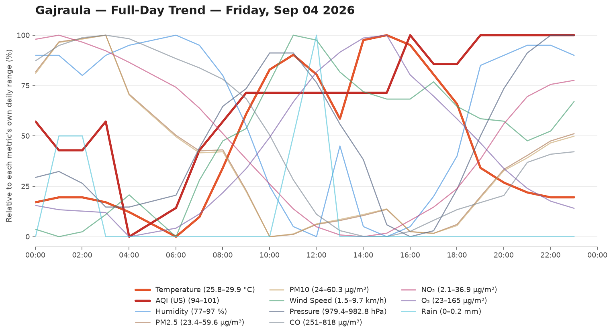

# 🌦️ Weather & AQI Logger

Automated Weather Logger. Logs Temperature,Humidity,Wind speed, Pressure and Air Quality Every Hour.

- **Data source:** [Open-Meteo](https://open-meteo.com/)
- **Update frequency:** every hour, via .[cron-job](https://cron-job.org/)
- **Raw data:** [`data/weather_log.csv`](data/weather_log.csv)

## 📊 Current Conditions

<!-- DATA-START -->
**Last updated:** `2026-09-05 11:31:03 UTC`

| Metric | Value |
|---|---|
| 🌡️ Temperature | 27.2 °C |
| 💧 Humidity | 92 % |
| 🌧️ Rain (last hr) | 0.0 mm |
| 💨 Wind Speed | 8.3 km/h |
| 🧭 Wind Direction | 49° |
| 🔵 Pressure | 980.2 hPa |
| 🌫️ AQI (US) | 75 — Moderate 🟡 |
| PM2.5 | 25.8 µg/m³ |
| PM10 | 26.2 µg/m³ |

<details><summary>Last 24 readings</summary>

| Time (UTC) | Temp °C | Rain mm | AQI | Wind km/h | Humidity % |
|---|---|---|---|---|---|
| 2026-09-05 11:31:03 | 27.2 | 0.0 | 75 | 8.3 | 92 |
| 2026-09-05 10:30:29 | 27.4 | 0.1 | 77 | 10.2 | 92 |
| 2026-09-05 09:30:26 | 27.1 | 0.2 | 77 | 11.1 | 90 |
| 2026-09-05 08:30:31 | 26.7 | 0.1 | 77 | 12.1 | 91 |
| 2026-09-05 07:30:34 | 28.0 | 0.0 | 77 | 9.9 | 89 |
| 2026-09-05 06:30:32 | 28.8 | 0.0 | 77 | 7.2 | 86 |
| 2026-09-05 05:30:31 | 27.9 | 0.0 | 77 | 9.9 | 88 |
| 2026-09-05 04:30:35 | 27.6 | 0.0 | 77 | 11.3 | 88 |
| 2026-09-05 03:30:33 | 27.2 | 0.0 | 78 | 10.3 | 90 |
| 2026-09-05 02:30:28 | 26.7 | 0.0 | 80 | 11.1 | 92 |
| 2026-09-05 01:30:35 | 26.1 | 0.0 | 82 | 9.0 | 95 |
| 2026-09-05 00:30:31 | 25.1 | 0.0 | 85 | 11.9 | 96 |
| 2026-09-04 23:30:28 | 25.4 | 0.1 | 87 | 9.8 | 97 |
| 2026-09-04 22:30:28 | 25.4 | 0.1 | 89 | 8.6 | 96 |
| 2026-09-04 21:30:35 | 25.4 | 0.2 | 101 | 7.1 | 96 |
| 2026-09-04 20:30:33 | 25.7 | 0.0 | 101 | 6.9 | 95 |
| 2026-09-04 19:30:37 | 26.1 | 0.1 | 101 | 9.4 | 95 |
| 2026-09-04 18:30:31 | 26.5 | 0.0 | 101 | 7.7 | 95 |
| 2026-09-04 17:30:29 | 26.6 | 0.0 | 101 | 7.0 | 95 |
| 2026-09-04 16:30:32 | 26.6 | 0.0 | 101 | 5.8 | 96 |
| 2026-09-04 15:30:33 | 26.7 | 0.0 | 101 | 5.4 | 96 |
| 2026-09-04 14:30:38 | 26.9 | 0.0 | 101 | 6.2 | 95 |
| 2026-09-04 13:30:34 | 27.2 | 0.0 | 101 | 6.3 | 94 |
| 2026-09-04 12:30:33 | 28.5 | 0.0 | 100 | 6.8 | 85 |

</details>
<!-- DATA-END -->

## 📈 Full-Day Trend

Every logged metric for yesterday (the last fully completed day, midnight-to-midnight IST), normalized to its own range so temperature, AQI, humidity, and the rest can be compared by shape on one chart. Only changes once a day, when a new day rolls over.


## 🗂️ Chart History

Every day's full-day trend chart, newest first. No retention limit — this grows forever.

<!-- HISTORY-START -->
<details><summary>Last 29 day(s)</summary>

**2026-09-04**


**2026-09-03**


**2026-09-02**


**2026-09-01**


**2026-08-31**


**2026-08-30**


**2026-08-29**


**2026-08-28**


**2026-08-27**


**2026-08-26**


**2026-08-25**


**2026-08-24**


**2026-08-23**


**2026-08-22**


**2026-08-21**


**2026-08-20**


**2026-08-19**


**2026-08-18**


**2026-08-17**


**2026-08-16**


**2026-08-15**


**2026-08-14**


**2026-08-13**


**2026-08-12**


**2026-08-11**


**2026-08-10**


**2026-08-09**


**2026-08-08**


**2026-08-07**


</details>
<!-- HISTORY-END -->

## 📁 Repo structure

```
weather-logger/
├── .github/workflows/update-weather.yml
├── data/weather_log.csv
├── data/day_chart.png
├── data/chart-history/        # every day, unlimited, e.g. 2026-08-08.png
├── scripts/fetch_weather.py
├── scripts/update_readme.py
├── scripts/generate_chart.py
├── scripts/backfill_chart_history.py
├── README.md
└── requirements.txt
```
