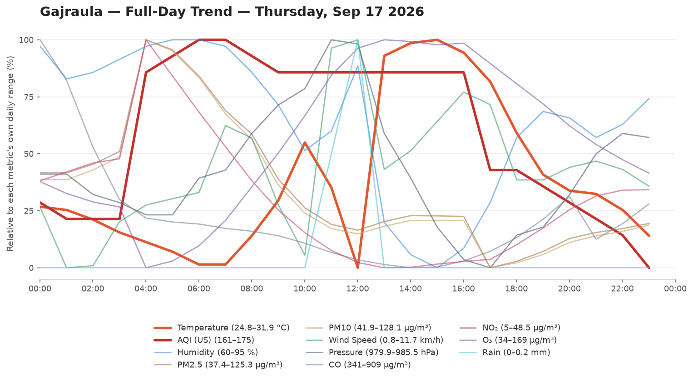
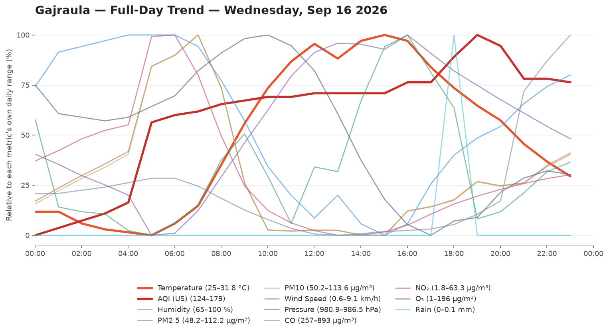
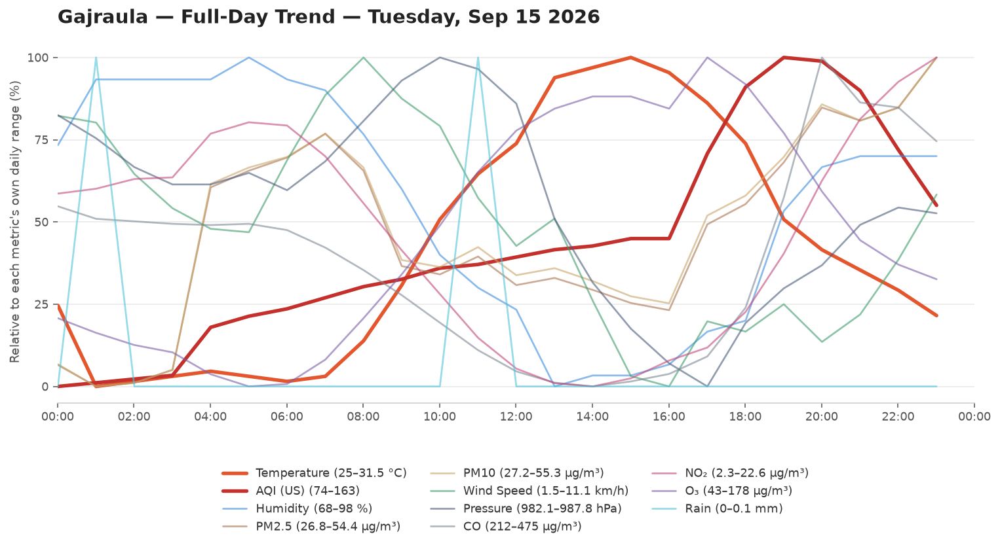
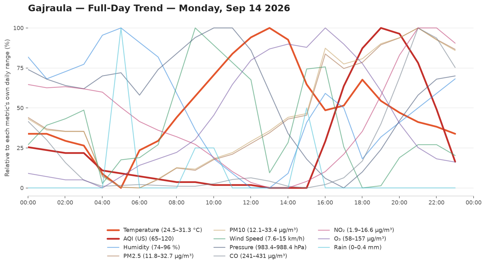

# 🌦️ Weather & AQI Logger

Automated Weather Logger. Logs Temperature,Humidity,Wind speed, Pressure and Air Quality Every Hour.

- **Data source:** [Open-Meteo](https://open-meteo.com/)
- **Update frequency:** every hour, via .[cron-job](https://cron-job.org/)
- **Raw data:** [`data/weather_log.csv`](data/weather_log.csv)

## 📊 Current Conditions

<!-- DATA-START -->
**Last updated:** `2026-09-17 22:30:28 UTC`

| Metric | Value |
|---|---|
| 🌡️ Temperature | 24.7 °C |
| 💧 Humidity | 92 % |
| 🌧️ Rain (last hr) | 0.0 mm |
| 💨 Wind Speed | 5.1 km/h |
| 🧭 Wind Direction | 276° |
| 🔵 Pressure | 982.5 hPa |
| 🌫️ AQI (US) | 154 — Unhealthy 🔴 |
| PM2.5 | 53.7 µg/m³ |
| PM10 | 60.3 µg/m³ |

<details><summary>Last 24 readings</summary>

| Time (UTC) | Temp °C | Rain mm | AQI | Wind km/h | Humidity % |
|---|---|---|---|---|---|
| 2026-09-17 22:30:28 | 24.7 | 0.0 | 154 | 5.1 | 92 |
| 2026-09-17 21:30:31 | 25.0 | 0.0 | 153 | 5.2 | 90 |
| 2026-09-17 20:30:34 | 25.4 | 0.0 | 155 | 4.5 | 88 |
| 2026-09-17 19:30:35 | 26.2 | 0.0 | 157 | 3.9 | 85 |
| 2026-09-17 18:30:30 | 25.2 | 0.0 | 159 | 5.1 | 88 |
| 2026-09-17 17:30:28 | 25.8 | 0.0 | 161 | 4.7 | 86 |
| 2026-09-17 16:30:31 | 26.6 | 0.0 | 163 | 5.5 | 82 |
| 2026-09-17 15:30:31 | 27.1 | 0.0 | 164 | 5.9 | 80 |
| 2026-09-17 14:30:34 | 27.2 | 0.0 | 165 | 5.6 | 83 |
| 2026-09-17 13:30:36 | 27.7 | 0.0 | 166 | 5.0 | 84 |
| 2026-09-17 12:30:30 | 29.0 | 0.0 | 167 | 5.0 | 80 |
| 2026-09-17 11:30:29 | 30.6 | 0.0 | 167 | 8.6 | 70 |
| 2026-09-17 10:30:35 | 31.5 | 0.0 | 173 | 9.2 | 63 |
| 2026-09-17 09:30:28 | 31.9 | 0.0 | 173 | 7.8 | 60 |
| 2026-09-17 08:30:31 | 31.8 | 0.0 | 173 | 6.4 | 62 |
| 2026-09-17 07:30:28 | 31.4 | 0.0 | 173 | 5.5 | 67 |
| 2026-09-17 06:30:26 | 24.8 | 0.2 | 173 | 11.7 | 91 |
| 2026-09-17 05:30:35 | 27.3 | 0.1 | 173 | 11.3 | 81 |
| 2026-09-17 04:30:30 | 28.7 | 0.0 | 173 | 1.4 | 78 |
| 2026-09-17 03:30:28 | 26.9 | 0.0 | 173 | 3.8 | 85 |
| 2026-09-17 02:30:30 | 25.8 | 0.0 | 174 | 7.0 | 90 |
| 2026-09-17 01:30:42 | 24.9 | 0.0 | 175 | 7.6 | 94 |
| 2026-09-17 00:30:30 | 24.9 | 0.0 | 175 | 4.4 | 95 |
| 2026-09-16 23:30:28 | 25.3 | 0.0 | 174 | 4.1 | 95 |

</details>
<!-- DATA-END -->

## 📈 Full-Day Trend

Every logged metric for yesterday (the last fully completed day, midnight-to-midnight IST), normalized to its own range so temperature, AQI, humidity, and the rest can be compared by shape on one chart. Only changes once a day, when a new day rolls over.


## 🗂️ Chart History

Every day's full-day trend chart, newest first. No retention limit — this grows forever.

<!-- HISTORY-START -->
<details><summary>Last 42 day(s)</summary>

**2026-09-17**


**2026-09-16**


**2026-09-15**


**2026-09-14**


**2026-09-13**


**2026-09-12**


**2026-09-11**


**2026-09-10**


**2026-09-09**


**2026-09-08**


**2026-09-07**


**2026-09-06**


**2026-09-05**


**2026-09-04**


**2026-09-03**


**2026-09-02**


**2026-09-01**


**2026-08-31**


**2026-08-30**


**2026-08-29**


**2026-08-28**


**2026-08-27**


**2026-08-26**


**2026-08-25**


**2026-08-24**


**2026-08-23**


**2026-08-22**


**2026-08-21**


**2026-08-20**


**2026-08-19**


**2026-08-18**


**2026-08-17**


**2026-08-16**


**2026-08-15**


**2026-08-14**


**2026-08-13**


**2026-08-12**


**2026-08-11**


**2026-08-10**


**2026-08-09**


**2026-08-08**


**2026-08-07**


</details>
<!-- HISTORY-END -->

## 📁 Repo structure

```
weather-logger/
├── .github/workflows/update-weather.yml
├── data/weather_log.csv
├── data/day_chart.png
├── data/chart-history/        # every day, unlimited, e.g. 2026-08-08.png
├── scripts/fetch_weather.py
├── scripts/update_readme.py
├── scripts/generate_chart.py
├── scripts/backfill_chart_history.py
├── README.md
└── requirements.txt
```
