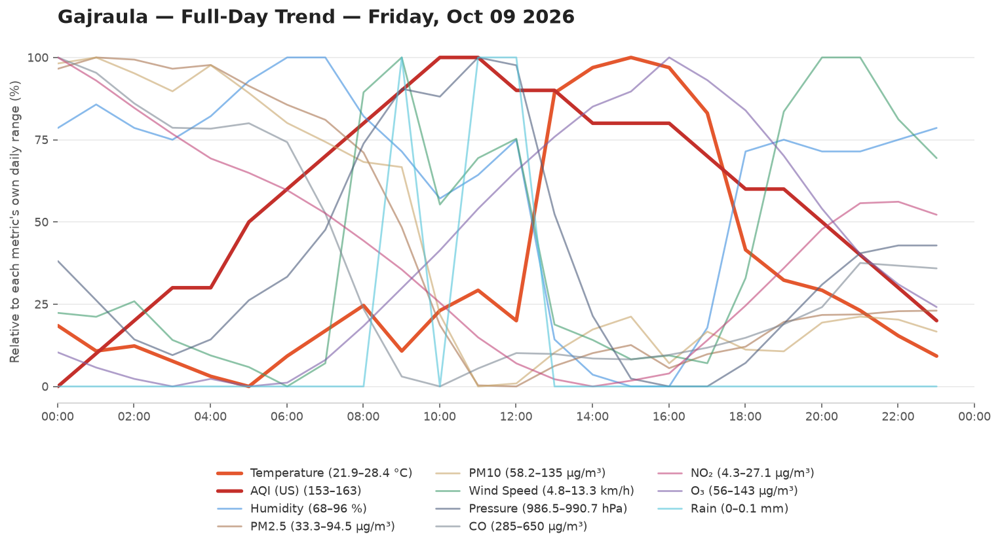

# 🌦️ Weather & AQI Logger

Automated Weather Logger. Logs Temperature,Humidity,Wind speed, Pressure and Air Quality Every Hour.

- **Data source:** [Open-Meteo](https://open-meteo.com/)
- **Update frequency:** every hour, via .[cron-job](https://cron-job.org/)
- **Raw data:** [`data/weather_log.csv`](data/weather_log.csv)

## 📊 Current Conditions

<!-- DATA-START -->
**Last updated:** `2026-10-10 15:30:34 UTC`

| Metric | Value |
|---|---|
| 🌡️ Temperature | 24.6 °C |
| 💧 Humidity | 84 % |
| 🌧️ Rain (last hr) | 0.0 mm |
| 💨 Wind Speed | 13.2 km/h |
| 🧭 Wind Direction | 88° |
| 🔵 Pressure | 989.3 hPa |
| 🌫️ AQI (US) | 96 — Moderate 🟡 |
| PM2.5 | 33.6 µg/m³ |
| PM10 | 55.3 µg/m³ |

<details><summary>Last 24 readings</summary>

| Time (UTC) | Temp °C | Rain mm | AQI | Wind km/h | Humidity % |
|---|---|---|---|---|---|
| 2026-10-10 15:30:34 | 24.6 | 0.0 | 96 | 13.2 | 84 |
| 2026-10-10 14:30:33 | 25.0 | 0.0 | 102 | 11.7 | 83 |
| 2026-10-10 13:30:31 | 25.5 | 0.0 | 103 | 9.7 | 82 |
| 2026-10-10 12:30:32 | 26.0 | 0.0 | 98 | 7.4 | 80 |
| 2026-10-10 11:30:28 | 27.3 | 0.0 | 99 | 9.2 | 74 |
| 2026-10-10 10:30:31 | 28.3 | 0.0 | 99 | 11.8 | 67 |
| 2026-10-10 09:30:37 | 28.6 | 0.0 | 104 | 12.9 | 64 |
| 2026-10-10 08:30:32 | 28.6 | 0.0 | 104 | 13.9 | 65 |
| 2026-10-10 07:30:31 | 28.2 | 0.0 | 105 | 12.5 | 67 |
| 2026-10-10 06:30:32 | 27.5 | 0.0 | 105 | 14.3 | 69 |
| 2026-10-10 05:30:30 | 26.6 | 0.0 | 106 | 14.7 | 75 |
| 2026-10-10 04:30:29 | 25.5 | 0.0 | 108 | 14.1 | 81 |
| 2026-10-10 03:30:33 | 24.3 | 0.0 | 111 | 14.1 | 86 |
| 2026-10-10 02:30:39 | 23.0 | 0.0 | 116 | 12.9 | 93 |
| 2026-10-10 01:30:33 | 22.0 | 0.0 | 121 | 10.7 | 97 |
| 2026-10-10 00:30:35 | 20.2 | 0.0 | 125 | 8.6 | 98 |
| 2026-10-09 23:30:30 | 20.4 | 0.0 | 131 | 7.8 | 97 |
| 2026-10-09 22:30:37 | 20.5 | 0.0 | 137 | 8.3 | 97 |
| 2026-10-09 21:30:33 | 20.6 | 0.0 | 149 | 8.5 | 97 |
| 2026-10-09 20:30:36 | 20.8 | 0.0 | 151 | 9.1 | 96 |
| 2026-10-09 19:30:38 | 21.1 | 0.0 | 153 | 10.3 | 96 |
| 2026-10-09 18:30:30 | 22.2 | 0.0 | 154 | 10.9 | 91 |
| 2026-10-09 17:30:35 | 22.5 | 0.0 | 155 | 10.7 | 90 |
| 2026-10-09 16:30:33 | 22.9 | 0.0 | 156 | 11.7 | 89 |

</details>
<!-- DATA-END -->

## 📈 Full-Day Trend

Every logged metric for yesterday (the last fully completed day, midnight-to-midnight IST), normalized to its own range so temperature, AQI, humidity, and the rest can be compared by shape on one chart. Only changes once a day, when a new day rolls over.


## 🗂️ Chart History

Every day's full-day trend chart, newest first. No retention limit — this grows forever.

<!-- HISTORY-START -->
<details><summary>Last 64 day(s)</summary>

**2026-10-09**


**2026-10-08**


**2026-10-07**


**2026-10-06**


**2026-10-05**


**2026-10-04**


**2026-10-03**


**2026-10-02**


**2026-10-01**


**2026-09-30**


**2026-09-29**


**2026-09-28**


**2026-09-27**


**2026-09-26**


**2026-09-25**


**2026-09-24**


**2026-09-23**


**2026-09-22**


**2026-09-21**


**2026-09-20**


**2026-09-19**


**2026-09-18**


**2026-09-17**


**2026-09-16**


**2026-09-15**


**2026-09-14**


**2026-09-13**


**2026-09-12**


**2026-09-11**


**2026-09-10**


**2026-09-09**


**2026-09-08**


**2026-09-07**


**2026-09-06**


**2026-09-05**


**2026-09-04**


**2026-09-03**


**2026-09-02**


**2026-09-01**


**2026-08-31**


**2026-08-30**


**2026-08-29**


**2026-08-28**


**2026-08-27**


**2026-08-26**


**2026-08-25**


**2026-08-24**


**2026-08-23**


**2026-08-22**


**2026-08-21**


**2026-08-20**


**2026-08-19**


**2026-08-18**


**2026-08-17**


**2026-08-16**


**2026-08-15**


**2026-08-14**


**2026-08-13**


**2026-08-12**


**2026-08-11**


**2026-08-10**


**2026-08-09**


**2026-08-08**


**2026-08-07**


</details>
<!-- HISTORY-END -->

## 📁 Repo structure

```
weather-logger/
├── .github/workflows/update-weather.yml
├── data/weather_log.csv
├── data/day_chart.png
├── data/chart-history/        # every day, unlimited, e.g. 2026-08-08.png
├── scripts/fetch_weather.py
├── scripts/update_readme.py
├── scripts/generate_chart.py
├── scripts/backfill_chart_history.py
├── README.md
└── requirements.txt
```
