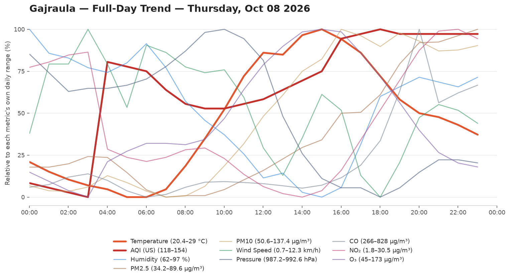
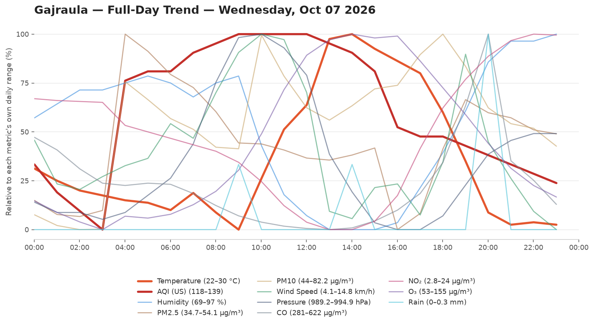
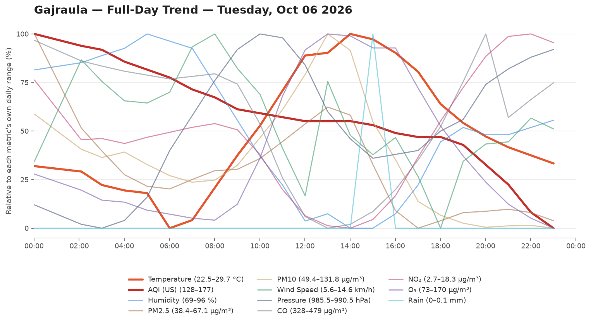

# 🌦️ Weather & AQI Logger

Automated Weather Logger. Logs Temperature,Humidity,Wind speed, Pressure and Air Quality Every Hour.

- **Data source:** [Open-Meteo](https://open-meteo.com/)
- **Update frequency:** every hour, via .[cron-job](https://cron-job.org/)
- **Raw data:** [`data/weather_log.csv`](data/weather_log.csv)

## 📊 Current Conditions

<!-- DATA-START -->
**Last updated:** `2026-10-09 02:30:35 UTC`

| Metric | Value |
|---|---|
| 🌡️ Temperature | 23.5 °C |
| 💧 Humidity | 91 % |
| 🌧️ Rain (last hr) | 0.0 mm |
| 💨 Wind Speed | 12.4 km/h |
| 🧭 Wind Direction | 64° |
| 🔵 Pressure | 989.6 hPa |
| 🌫️ AQI (US) | 161 — Unhealthy 🔴 |
| PM2.5 | 76.8 µg/m³ |
| PM10 | 110.6 µg/m³ |

<details><summary>Last 24 readings</summary>

| Time (UTC) | Temp °C | Rain mm | AQI | Wind km/h | Humidity % |
|---|---|---|---|---|---|
| 2026-10-09 02:30:35 | 23.5 | 0.0 | 161 | 12.4 | 91 |
| 2026-10-09 01:30:33 | 23.0 | 0.0 | 160 | 5.4 | 96 |
| 2026-10-09 00:30:37 | 22.5 | 0.0 | 159 | 4.8 | 96 |
| 2026-10-08 23:30:30 | 21.9 | 0.0 | 158 | 5.3 | 94 |
| 2026-10-08 22:30:34 | 22.1 | 0.0 | 156 | 5.6 | 91 |
| 2026-10-08 21:30:31 | 22.4 | 0.0 | 156 | 6.0 | 89 |
| 2026-10-08 20:30:34 | 22.7 | 0.0 | 155 | 7.0 | 90 |
| 2026-10-08 19:30:39 | 22.6 | 0.0 | 154 | 6.6 | 92 |
| 2026-10-08 18:30:34 | 23.1 | 0.0 | 153 | 6.7 | 90 |
| 2026-10-08 17:30:37 | 23.6 | 0.0 | 153 | 5.8 | 87 |
| 2026-10-08 16:30:37 | 24.1 | 0.0 | 153 | 6.7 | 85 |
| 2026-10-08 15:30:31 | 24.5 | 0.0 | 153 | 7.1 | 86 |
| 2026-10-08 14:30:45 | 24.7 | 0.0 | 153 | 6.2 | 87 |
| 2026-10-08 13:30:32 | 25.4 | 0.0 | 153 | 3.1 | 85 |
| 2026-10-08 12:30:33 | 26.6 | 0.0 | 154 | 0.7 | 83 |
| 2026-10-08 11:30:32 | 27.8 | 0.0 | 153 | 2.2 | 73 |
| 2026-10-08 10:30:39 | 28.5 | 0.0 | 152 | 6.7 | 64 |
| 2026-10-08 09:30:34 | 29.0 | 0.0 | 145 | 7.8 | 62 |
| 2026-10-08 08:30:31 | 28.7 | 0.0 | 143 | 4.8 | 63 |
| 2026-10-08 07:30:37 | 27.7 | 0.0 | 141 | 2.2 | 67 |
| 2026-10-08 06:30:32 | 27.8 | 0.0 | 139 | 4.1 | 66 |
| 2026-10-08 05:30:30 | 26.6 | 0.0 | 138 | 7.6 | 71 |
| 2026-10-08 04:30:34 | 24.9 | 0.0 | 137 | 9.5 | 75 |
| 2026-10-08 03:30:34 | 23.4 | 0.0 | 137 | 9.3 | 78 |

</details>
<!-- DATA-END -->

## 📈 Full-Day Trend

Every logged metric for yesterday (the last fully completed day, midnight-to-midnight IST), normalized to its own range so temperature, AQI, humidity, and the rest can be compared by shape on one chart. Only changes once a day, when a new day rolls over.


## 🗂️ Chart History

Every day's full-day trend chart, newest first. No retention limit — this grows forever.

<!-- HISTORY-START -->
<details><summary>Last 63 day(s)</summary>

**2026-10-08**


**2026-10-07**


**2026-10-06**


**2026-10-05**


**2026-10-04**


**2026-10-03**


**2026-10-02**


**2026-10-01**


**2026-09-30**


**2026-09-29**


**2026-09-28**


**2026-09-27**


**2026-09-26**


**2026-09-25**


**2026-09-24**


**2026-09-23**


**2026-09-22**


**2026-09-21**


**2026-09-20**


**2026-09-19**


**2026-09-18**


**2026-09-17**


**2026-09-16**


**2026-09-15**


**2026-09-14**


**2026-09-13**


**2026-09-12**


**2026-09-11**


**2026-09-10**


**2026-09-09**


**2026-09-08**


**2026-09-07**


**2026-09-06**


**2026-09-05**


**2026-09-04**


**2026-09-03**


**2026-09-02**


**2026-09-01**


**2026-08-31**


**2026-08-30**


**2026-08-29**


**2026-08-28**


**2026-08-27**


**2026-08-26**


**2026-08-25**


**2026-08-24**


**2026-08-23**


**2026-08-22**


**2026-08-21**


**2026-08-20**


**2026-08-19**


**2026-08-18**


**2026-08-17**


**2026-08-16**


**2026-08-15**


**2026-08-14**


**2026-08-13**


**2026-08-12**


**2026-08-11**


**2026-08-10**


**2026-08-09**


**2026-08-08**


**2026-08-07**


</details>
<!-- HISTORY-END -->

## 📁 Repo structure

```
weather-logger/
├── .github/workflows/update-weather.yml
├── data/weather_log.csv
├── data/day_chart.png
├── data/chart-history/        # every day, unlimited, e.g. 2026-08-08.png
├── scripts/fetch_weather.py
├── scripts/update_readme.py
├── scripts/generate_chart.py
├── scripts/backfill_chart_history.py
├── README.md
└── requirements.txt
```
