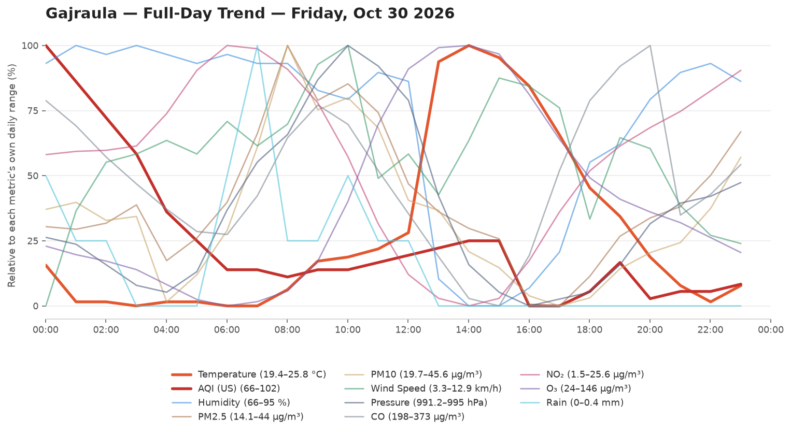
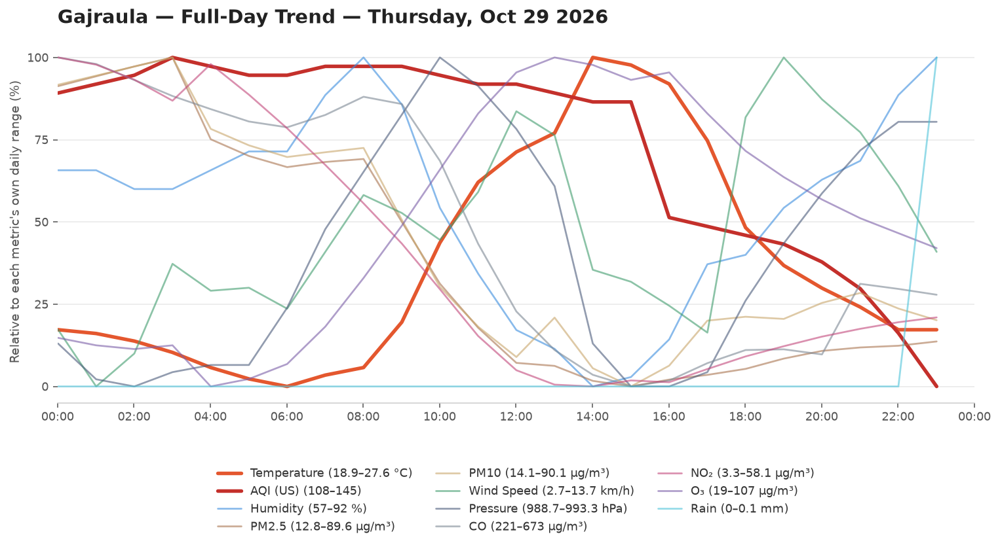
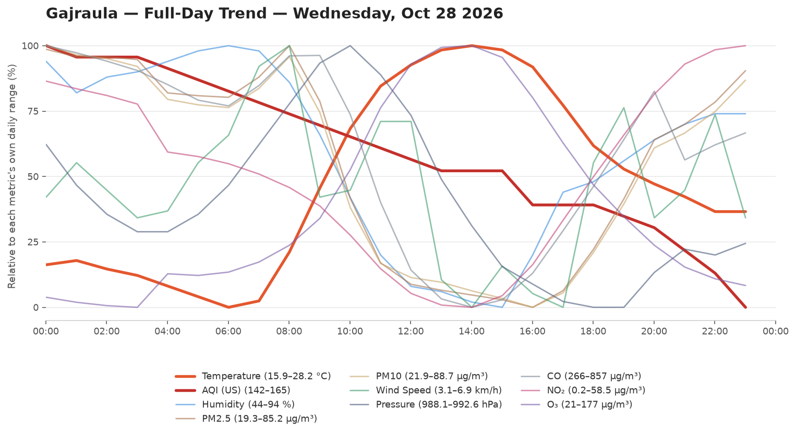

# 🌦️ Weather & AQI Logger

Automated Weather Logger. Logs Temperature,Humidity,Wind speed, Pressure and Air Quality Every Hour.

- **Data source:** [Open-Meteo](https://open-meteo.com/)
- **Update frequency:** every hour, via .[cron-job](https://cron-job.org/)
- **Raw data:** [`data/weather_log.csv`](data/weather_log.csv)

## 📊 Current Conditions

<!-- DATA-START -->
**Last updated:** `2026-10-31 17:30:29 UTC`

| Metric | Value |
|---|---|
| 🌡️ Temperature | 19.4 °C |
| 💧 Humidity | 96 % |
| 🌧️ Rain (last hr) | 0.0 mm |
| 💨 Wind Speed | 5.7 km/h |
| 🧭 Wind Direction | 261° |
| 🔵 Pressure | 992.0 hPa |
| 🌫️ AQI (US) | 106 — Unhealthy for Sensitive Groups 🟠 |
| PM2.5 | 104.5 µg/m³ |
| PM10 | 130.4 µg/m³ |

<details><summary>Last 24 readings</summary>

| Time (UTC) | Temp °C | Rain mm | AQI | Wind km/h | Humidity % |
|---|---|---|---|---|---|
| 2026-10-31 17:30:29 | 19.4 | 0.0 | 106 | 5.7 | 96 |
| 2026-10-31 16:30:28 | 19.8 | 0.0 | 98 | 4.3 | 95 |
| 2026-10-31 15:30:33 | 20.5 | 0.0 | 94 | 3.3 | 92 |
| 2026-10-31 14:30:30 | 21.4 | 0.0 | 90 | 2.9 | 88 |
| 2026-10-31 13:30:28 | 22.2 | 0.0 | 89 | 3.7 | 85 |
| 2026-10-31 12:30:31 | 22.8 | 0.0 | 87 | 5.4 | 80 |
| 2026-10-31 11:30:30 | 24.5 | 0.0 | 86 | 5.7 | 72 |
| 2026-10-31 10:30:31 | 26.1 | 0.0 | 85 | 7.5 | 63 |
| 2026-10-31 09:30:33 | 26.6 | 0.0 | 87 | 9.0 | 59 |
| 2026-10-31 08:30:31 | 26.8 | 0.0 | 86 | 9.2 | 58 |
| 2026-10-31 07:30:31 | 26.5 | 0.0 | 86 | 8.4 | 60 |
| 2026-10-31 06:30:30 | 25.1 | 0.0 | 86 | 3.5 | 67 |
| 2026-10-31 05:30:30 | 24.0 | 0.0 | 85 | 2.2 | 73 |
| 2026-10-31 04:30:32 | 22.8 | 0.0 | 84 | 1.3 | 78 |
| 2026-10-31 03:30:33 | 21.4 | 0.0 | 82 | 0.5 | 84 |
| 2026-10-31 02:30:31 | 19.7 | 0.0 | 80 | 2.1 | 90 |
| 2026-10-31 01:30:33 | 18.2 | 0.0 | 78 | 3.6 | 96 |
| 2026-10-31 00:30:30 | 17.7 | 0.0 | 76 | 3.1 | 97 |
| 2026-10-30 23:30:35 | 18.6 | 0.0 | 75 | 6.7 | 96 |
| 2026-10-30 22:30:30 | 18.8 | 0.0 | 74 | 5.6 | 95 |
| 2026-10-30 21:30:34 | 19.4 | 0.0 | 73 | 6.1 | 92 |
| 2026-10-30 20:30:37 | 19.8 | 0.0 | 73 | 8.5 | 91 |
| 2026-10-30 19:30:33 | 19.8 | 0.0 | 72 | 8.7 | 93 |
| 2026-10-30 18:30:34 | 20.5 | 0.0 | 71 | 5.1 | 89 |

</details>
<!-- DATA-END -->

## 📈 Full-Day Trend

Every logged metric for yesterday (the last fully completed day, midnight-to-midnight IST), normalized to its own range so temperature, AQI, humidity, and the rest can be compared by shape on one chart. Only changes once a day, when a new day rolls over.


## 🗂️ Chart History

Every day's full-day trend chart, newest first. No retention limit — this grows forever.

<!-- HISTORY-START -->
<details><summary>Last 85 day(s)</summary>

**2026-10-30**


**2026-10-29**


**2026-10-28**


**2026-10-27**


**2026-10-26**


**2026-10-25**


**2026-10-24**


**2026-10-23**


**2026-10-22**


**2026-10-21**


**2026-10-20**


**2026-10-19**


**2026-10-18**


**2026-10-17**


**2026-10-16**


**2026-10-15**


**2026-10-14**


**2026-10-13**


**2026-10-12**


**2026-10-11**


**2026-10-10**


**2026-10-09**


**2026-10-08**


**2026-10-07**


**2026-10-06**


**2026-10-05**


**2026-10-04**


**2026-10-03**


**2026-10-02**


**2026-10-01**


**2026-09-30**


**2026-09-29**


**2026-09-28**


**2026-09-27**


**2026-09-26**


**2026-09-25**


**2026-09-24**


**2026-09-23**


**2026-09-22**


**2026-09-21**


**2026-09-20**


**2026-09-19**


**2026-09-18**


**2026-09-17**


**2026-09-16**


**2026-09-15**


**2026-09-14**


**2026-09-13**


**2026-09-12**


**2026-09-11**


**2026-09-10**


**2026-09-09**


**2026-09-08**


**2026-09-07**


**2026-09-06**


**2026-09-05**


**2026-09-04**


**2026-09-03**


**2026-09-02**


**2026-09-01**


**2026-08-31**


**2026-08-30**


**2026-08-29**


**2026-08-28**


**2026-08-27**


**2026-08-26**


**2026-08-25**


**2026-08-24**


**2026-08-23**


**2026-08-22**


**2026-08-21**


**2026-08-20**


**2026-08-19**


**2026-08-18**


**2026-08-17**


**2026-08-16**


**2026-08-15**


**2026-08-14**


**2026-08-13**


**2026-08-12**


**2026-08-11**


**2026-08-10**


**2026-08-09**


**2026-08-08**


**2026-08-07**


</details>
<!-- HISTORY-END -->

## 📁 Repo structure

```
weather-logger/
├── .github/workflows/update-weather.yml
├── data/weather_log.csv
├── data/day_chart.png
├── data/chart-history/        # every day, unlimited, e.g. 2026-08-08.png
├── scripts/fetch_weather.py
├── scripts/update_readme.py
├── scripts/generate_chart.py
├── scripts/backfill_chart_history.py
├── README.md
└── requirements.txt
```
